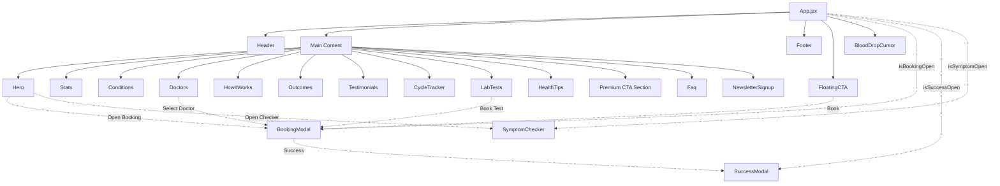
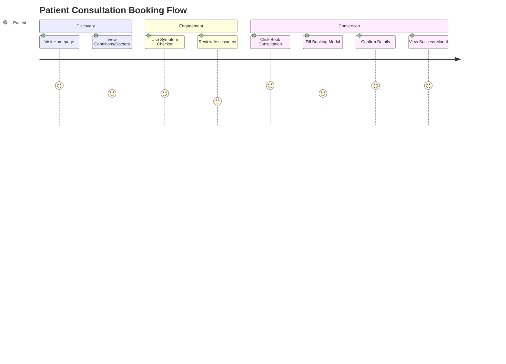

# HEALNARI Application

HEALNARI is a comprehensive women's healthcare web application built with React and Tailwind CSS. It provides a platform for symptom checking, booking consultations, tracking cycles, and accessing personalized health resources.

## Implementation Diagrams

### 1. Component Architecture

The following diagram illustrates the component hierarchy and structure of the HEALNARI application.



### 2. User Flow Diagram

This diagram represents the primary user journeys within the application, such as booking a consultation or using the symptom checker.



## Setup & Execution

1. **Install Dependencies:**
   ```bash
   npm install
   ```

2. **Run Development Server:**
   ```bash
   npm run dev
   ```

3. **Build for Production:**
   ```bash
   npm run build
   ```

## Tech Stack
- **Framework:** React (Vite)
- **Styling:** Tailwind CSS
- **Icons:** FontAwesome
- **Animations:** Custom CSS / Tailwind Animations
